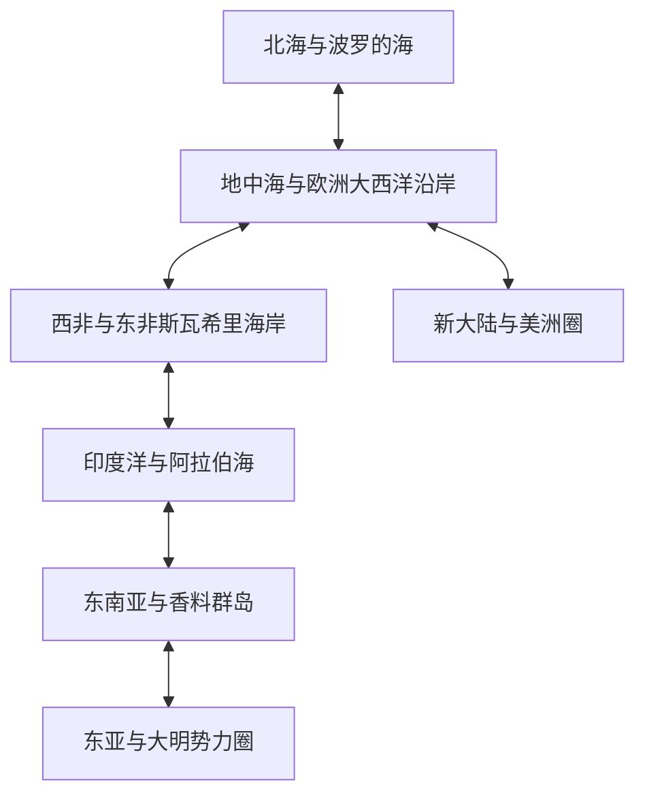

# 全球断代史实与世界观设计档案 (V1)

**Designed and Compiled by Gemini (AI Assistant)**

> **前置要求**：本文件严格遵守 [content-methodology.md](content-methodology.md) 的八步流程与 [world-overview.md](world-overview.md) 中的叙事纪律（P1-P5 政治敏感性与视角指引）。
> **状态**：V1 阶段全球档案库。包含**全球贸易圈与势力板块概览**，以及 4 个走完完整 8 步流程的**深度历史档案实体**（对应 East Asia、Northern Europe、Southeast Asia/Indian Ocean、Americas）。
> **信息源标准**：L1 史实层使用中立学术界共识，L5 推测显式标明。

---

## 一、 全球贸易圈与势力板块概览

为了支撑 6 位主角在第一章到终局（L1 - L5 暗线）的平滑过渡，我们将全球海域划分为以下 6 个核心贸易圈与势力板块，并为其设计了玩法和叙事钩子。



### 1. 东亚与大明势力圈 (East Asia & Ming Dynasty)
*   **势力范围**：大明帝国（南直隶、福建、广东）、日本战国诸大名（萨摩岛津氏、大内/毛利氏）、朝鲜王朝、琉球王国。
*   **核心商网与特产**：丝绸、生丝、景德镇瓷器、松江棉布、茶、日本白银、高丽人参。
*   **走私网络 (Smuggling Network)**：以**福建月港 (Yuegang / Haicheng)** 为轴心的走私集团，勾连日本萨摩藩与双子群岛（Sakai/Nagasaki 航线），暗中突破大明的朝贡体制和“海禁”政策。
*   **暗线与叙事钩子**：
    *   **L2 级商业冲突**：朝廷内监与江浙士绅争夺生丝出口定价权，雇佣倭寇劫掠非合作商船。
    *   **L3 级政治颠覆**：葡萄牙人在澳门的定居权交涉，牵涉到内阁与地方官员的政治博弈。

### 2. 东南亚与香料群岛 (Southeast Asia & Spice Islands)
*   **势力范围**：马六甲苏丹国遗脉（柔佛苏丹国）、亚齐苏丹国、万丹苏丹国、德尔纳特与蒂多雷双苏丹国。
*   **核心商网与特产**：香料（丁香、豆蔻）、檀香木、燕窝、锡砂。
*   **商网机制**：香料群岛的胡椒与丁香，在马六甲被季风商船运往印度洋，或是由大明走私船北运。
*   **暗线与叙事钩子**：
    *   **L2 级商业垄断**：欧洲联合商会（信标会代理人）试图与德尔纳特苏丹签订免税排他性买断协定。
    *   **L4 级神秘学**：在班达群岛的失落遗迹中，流传着能指引季风恒定吹拂的“翡翠航仪”传说。

### 3. 印度洋与阿拉伯海 (Indian Ocean & Arabian Sea)
*   **势力范围**：莫卧儿帝国、古吉拉特苏丹国、萨非王朝（伊朗）、葡萄牙印度领地（Goa/Diu）。
*   **核心商网与特产**：印花棉布（卡利库特细布）、克什米尔羊绒、阿拉伯马、乳香、没药。
*   **商网机制**：连接东非（Sofala/Zanzibar Gold）、阿拉伯海与南中国海的中枢，是财富交汇的“核心大动脉”。
*   **暗线与叙事钩子**：
    *   **L3 级政治博弈**：奥斯曼红海舰队与葡萄牙海事法庭争夺印度洋的巡航护照发放权。
    *   **L5 级终局暗示**：波斯湾红土遗迹中出土的石板，记录了信标会分裂前的原始契约。

### 4. 地中海与西欧大西洋 (Mediterranean & Western Europe)
*   **势力范围**：西班牙哈布斯堡王朝、葡萄牙阿维斯王朝、热那亚商会、威尼斯共和国、奥斯曼帝国。
*   **核心商网与特产**：伊比利亚火器、热那亚天鹅绒、威尼斯玻璃器、雪利酒、橄榄油。
*   **商网机制**：威尼斯垄断东地中海香料北运，葡萄牙开辟绕过好望角的印海大航线，西班牙在大西洋上运送美洲白银。
*   **暗线与叙事钩子**：
    *   **L2 级冲突**：热那亚高利贷集团对西班牙王室债务的挤兑，直接影响到新航线的特许授权。
    *   **L4 级神秘学**：信标会西欧分部对圣殿骑士团遗失资产（塞维利亚地底）的长期发掘。

### 5. 北海与波罗的海 (North Sea & Baltic Sea)
*   **势力范围**：汉萨同盟、英格兰王国、尼德兰北方省份（起义军背景）、瑞典王国。
*   **核心商网与特产**：北海鲱鱼干、波罗的海木材、琥珀、呢绒、白蜡。
*   **商网机制**：波罗的海为大航海时代提供造船所需的关键桅杆与松脂，汉萨同盟控制着传统北海航线。
*   **暗线与叙事钩子**：
    *   **L3 级博弈**：英国私掠船在海峡对西班牙大帆船的劫掠，实为暗中获取新大陆航海海图。
    *   **L4 级遗物**：波罗的海的琥珀中封存着被掩盖的历史密码。

### 6. 新大陆与美洲圈 (New World & Americas)
*   **势力范围**：西班牙新西班牙总督区、秘鲁总督区、玛雅/印加抵抗村落。
*   **核心商网与特产**：白银（波托西银矿）、可可、烟草、染料木。
*   **商网机制**：单向的输入输出流向，西班牙珍宝船队（Silver Fleet）将海量金银运回塞维利亚。
*   **暗线与叙事钩子**：
    *   **L1 级反派**：狂热的殖民地总督与肆虐的加勒比海盗。
    *   **L5 级真相**：南美亚马逊雨林深处的失落文明遗迹，与地中海遗迹使用完全一致的星图刻纹。

---

## 二、 深度历史档案实体（4 步流程样例）

以下是使用 8 步流程（按照方法论 V0）详尽设计的 4 个全球宝物/遗迹实体，已完成数据建模，可以直接转译为 TS 代码。

### 实体 1：月港私商特许状 (Yuegang Smuggling Permit)

#### 1. 概览
| 字段 | 值 |
| --- | --- |
| 中文名 | 月港私商特许状（或大明中左所商帖） |
| 英文名 | Yuegang Smuggling Permit |
| 日文名 | 月港密貿易許可状 |
| 类别 | 纸本文书 / 地方特许件 |
| 暗线层 | L2 |
| 必加 / 可选 | 必加 |
| 信息源等级 | L1（福建地方志）+ L2（学术） |

#### 2. 步骤 1：采集（历史锚点）
- **月港**：福建漳州海澄县，大明在隆庆改元（1567 年）前名义上严厉海禁，但月港一直是东亚最庞大的私人海外贸易网络中心。
- **商帖/引税**：隆庆开海后，大明发放“船引”限制出海船数，而海禁期间，地方豪绅与海防将领私下勾结发放“防倭水饷凭证”或“商帖”，作为出航的安全保证。
- **萨摩岛津氏**：日本南端薩摩藩直接控制琉球，并暗中从月港获取中国生丝，运回日本。

#### 3. 步骤 2：筛选
- **Q1 玩**：✓ 玩家可作为 Ali/Joao 路线在月港获取，凭此证通关明朝沿海卫所巡航，或卖给日本萨摩藩商会。
- **Q2 异**：✓ 这是东亚独特的“半合法”文书，代表了朝贡体制外的私商博弈。
- **Q3 链**：✓ 链接月港、Sakai 港口、地方督抚派系、倭寇NPC。
- **过滤分级**：必加。

#### 4. 步骤 3：视角自查
- **亚/中**：突出大明民间商人的务实与抗争，而不是朝廷公文里的“顺从”。
- **欧/西**：在欧洲水手眼里，这只是一张“充满东方玄学和行贿痕迹的纸”，反映出对东方体制的认知盲区。

#### 5. 步骤 4：钩子设计 (storyHooks)
```yaml
storyHooks:
  protagonists: [ali, joao, ernst]
  factions: [ming_navy, satsuma_clan, yuegang_merchants]
  darkLineLayer: L2
  fameTriggers: [trade_fame]
  crossLinks:
    - "yuegang_port"
    - "sakai_port"
  triggers:
    - location: yuegang
      condition: "fame.trade >= 800 AND gold >= 10000"
  rewards:
    - "trade_fame: 2000"
    - "item: yuegang_smuggling_permit"
```

#### 6. 步骤 5：三层文本（风闻 / 记录 / 博物）
*   **风闻（Pub Gossip）**：
    > 里斯本酒馆的东亚航线大副林阿九对你说：
    > “你想去大明的沿海做买卖？别看官兵天天喊海禁，其实海防衙门的千总老王家里，生丝堆得像山一样。去月港的栈房找掌柜，多花点银子买张‘商帖’，只要遇上巡海兵船，亮一下就保你平安。不过千万别被京城来的御史大人瞧见。”
*   **记录（Archives Record）**：
    > 《海防卫所防剿私入海船册》（嘉靖三十八年，漳州卫手抄本）：
    > “……兹查获月港双桅私商船一只，搜出大明中左所商帖一幅，上盖海澄水师印绶，称此船系‘办水饷防倭商船’。**实则此帖乃豪绅李氏勾结水师千总所得，用以走私日本萨摩白银**。念及地方安定，已将此帖收档，船只放行，水饷按期入账。”
*   **博物（Exhibit Description）**：
    > **月港私商特许状 · 编号 EA-042**
    > **材质**：福建土产竹浆纸，局部盖有朱砂大印“海澄水防”。
    > **年代**：16 世纪中叶大明嘉靖至隆庆年间。
    > **内容**：以行书写明“某某商行船只前往东洋，按期缴纳水饷，系官防许可，沿海卫所毋得刁难阻滞。”此乃海禁时期大明地方官商一体、变相收税并纵容私商贸易的历史铁证。

---

### 实体 2：北海琥珀之匣 (Amber Casket of the Baltic)

#### 1. 概览
| 字段 | 值 |
| --- | --- |
| 中文名 | 北海琥珀之匣（或汉萨秘密公文匣） |
| 英文名 | Amber Casket of the Baltic |
| 日文名 | バルト海の琥珀の匣 |
| 类别 | 艺术品 / 秘密公文匣 |
| 暗线层 | L3 |
| 必加 / 可选 | 必加 |
| 信息源等级 | L1（汉萨同盟商契）+ L2（学术） + L5（戏剧化补充） |

#### 2. 步骤 1：采集（历史锚点）
- **波罗的海琥珀**：但泽（Gdańsk）和柯尼斯堡（Königsberg）是著名的波罗的海琥珀产地，中世纪起由条顿骑士团 and 汉萨同盟垄断出口。
- **汉萨同盟（Hanseatic League）**：以吕贝克为盟主的德意志商人群体，15-16 世纪面临新兴英国商人和尼德兰起义的内外夹击，其垄断地位正急剧衰退。

#### 3. 步骤 2：筛选
- **Q1 玩**：✓ 玩家可在伦敦、阿姆斯特丹、但泽港口通过寻找获得，解开汉萨同盟在北海衰落的秘密。
- **Q2 异**：✓ 它是以欧洲独特的贵重材料“琥珀”为载体的解密类宝物。
- **Q3 链**：✓ 链接 Otto 路线、Pietro 路线、伦敦酒馆、北海航线。
- **过滤分级**：必加。

#### 4. 步骤 3：视角自查
- **欧/西**：呈现北欧商人群体在宗教改革与现代民族国家（英格兰）崛起时期的精明和挣扎，而不是光鲜的“帝国史”。
- **非欧**：在亚洲海商眼里，这不过是一个“盛产透明黄色松脂石头的木盒子”，凸显材料认知的地域差异。

#### 5. 步骤 4：钩子设计 (storyHooks)
```yaml
storyHooks:
  protagonists: [otto, pietro, catalina]
  factions: [hanseatic_league, english_privateers, beacon_order]
  darkLineLayer: L3
  fameTriggers: [adventure_fame]
  crossLinks:
    - "lubeck_port"
    - "london_pub"
  triggers:
    - location: gdansk
      condition: "fame.adventure >= 1200"
  rewards:
    - "adventure_fame: 3000"
    - "item: amber_casket"
```

#### 6. 步骤 5：三层文本（风闻 / 记录 / 博物）
*   **风闻（Pub Gossip）**：
    > 伦敦酒馆里喝醉的汉萨同盟天青石商人对你低声说：
    > “我们吕贝克的同盟没钱了？放屁！我们的商契都锁在但泽城主府的‘琥珀之匣’里。那匣子表面全是老琥珀雕的花，据说里面不仅有我们和瑞典国王的铁矿密契，还锁着当年条顿骑士团从圣地带回来的、能改变大西洋风向的几张圣地旧海图……”
*   **记录（Archives Record）**：
    > 《英格兰海军谍报总署·北海商路监控备忘录》（1512 年）：
    > “……密报称，但在堡已秘密转移‘琥珀之匣’。**此匣非寻常金银，乃由但泽极品天然金琥珀板料拼接而成，内藏汉萨同盟与西班牙总督联手围剿我英吉利私掠船的秘密名录**。一旦获得此匣，即可掌握其财务底线与勾结铁证。”
*   **博物（Exhibit Description）**：
    > **北海琥珀之匣 · 编号 NE-109**
    > **材质**：天然白垩纪金琥珀板拼接，内衬橡木骨架，黄铜锁扣。
    > **年代**：约 15 世纪末汉萨同盟鼎盛期末叶。
    > **内容**：匣子夹层内藏有羊皮纸公文，刻有早期北欧航线潮汐表及信标会吕贝克分部的暗语契约。此物为研究波罗的海琥珀工艺与中世纪德意志垄断贸易消亡的珍贵文物。

---

### 实体 3：德尔纳特黄金丁香 (Golden Clove of Ternate)

#### 1. 概览
| 字段 | 值 |
| --- | --- |
| 中文名 | 德尔纳特黄金丁香（或香料群岛条约圣物） |
| 英文名 | Golden Clove of Ternate |
| 日文名 | テルナテの黄金丁香 |
| 类别 | 圣物 / 特许仪式物 |
| 暗线层 | L4 |
| 必加 / 可选 | 必加 |
| 信息源等级 | L1（香料群岛地方传说）+ L2（学术） |

#### 2. 步骤 1：采集（历史锚点）
- **德尔纳特（Ternate）**：盛产优质丁香（Cloves）的火山岛，是香料群岛最强盛的苏丹国之一。
- **丁香特许权**：葡萄牙和西班牙通过《萨拉戈萨条约》（1529 年）争夺此地的香料霸权。为了获取土著支持，两国传教士与当地苏丹进行盟誓，制作了由纯金打造的火山丁香模型作为防卫与盟誓物。

#### 3. 步骤 2：筛选
- **Q1 玩**：✓ Ernst（制图）或 Ali（商债）路线在东南亚香料航线核心区获取，用于解锁香料群岛的排他性采购权。
- **Q2 异**：✓ 这是直接与大航海时代真正的引线——“香料贸易”相关的黄金圣物。
- **Q3 链**：✓ 链接 Ternate 港口、Banda 港口、欧洲联合商会、东南亚主角剧情。
- **过滤分级**：必加。

#### 4. 步骤 3：视角自查
- **亚/中**：展现当地火山苏丹国在两家欧洲强权（西班牙/葡萄牙）之间巧妙周旋的自主外交智慧，避免“单向被征服”的历史偏见。
- **欧/西**：在欧洲征服者日记里，这被描述为“土著苏丹用于表示臣服的贡物”，与本地视角的“誓约契记”形成鲜明张力。

#### 5. 步骤 4：钩子设计 (storyHooks)
```yaml
storyHooks:
  protagonists: [ali, ernst, joao]
  factions: [ternate_sultanate, portuguese_india, spice_cartel]
  darkLineLayer: L4
  fameTriggers: [trade_fame]
  crossLinks:
    - "ternate_port"
    - "malacca_market"
  triggers:
    - location: ternate
      condition: "fame.trade >= 1500 AND daysElapsed >= 90"
  rewards:
    - "trade_fame: 4000"
    - "unlock: ternate_exclusive_cloves"
```

#### 6. 步骤 5：三层文本（风闻 / 记录 / 博物）
*   **风闻（Pub Gossip）**：
    > 马六甲码头旅馆里喝着椰子酒的摩鹿加水手对你耳语：
    > “苏丹的宝库里有一枚金丁香。不是地里长出来的，是当年白人神父跟苏丹签订和平契约时，用达马尔树脂做模子浇筑出来的纯金宝贝。谁拿到这枚金丁香，火山神就会保佑他的船舱装满丁香时不会在返航的海里腐烂发潮……”
*   **记录（Archives Record）**：
    > 《莫卧儿商船水手长巴布尔在马六甲的口述记录》（1515 年）：
    > “……德尔纳特苏丹将一枚黄金铸造的丁香赠与白人提督，作为允许其在特纳特修筑城堡的信凭。**苏丹宣称此物有火山神力保护，但依我看，这只是土人为了将大笔白银和香料税留在港口，与西方人打交道的权宜之计**。”
*   **博物（Exhibit Description）**：
    > **德尔纳特黄金丁香 · 编号 SEA-081**
    > **材质**：22K 纯金，重 320 克，造型为完全成熟的丁香四角花蕾，底部刻有爪哇文字（Kawi 字母）及葡萄牙皇家盾徽。
    > **年代**：约 1530 年萨拉戈萨条约签订前后。
    > **内容**：此黄金丁香是欧洲殖民势力为了独占全球最高价香料（丁香）出口权，与当地德尔纳特苏丹盟誓合作的历史物证，体现了早期东南亚“香料政治”与火山文明交互的复杂性。

---

### 实体 4：阿兹特克金面具 (Golden Mask of Tenochtitlan)

#### 1. 概览
| 字段 | 值 |
| --- | --- |
| 中文名 | 阿兹特克金面具（或特诺奇蒂特兰眼泪） |
| 英文名 | Golden Mask of Tenochtitlan |
| 日文名 | アステカの黄金の仮面 |
| 类别 | 圣物 / 美洲遗存 |
| 暗线层 | L5 |
| 必加 / 可选 | 必加 |
| 信息源等级 | L1（原住民抄本）+ L2（学术） + L5（终局暗示） |

#### 2. 步骤 1：采集（历史锚点）
- **特诺奇蒂特兰（Tenochtitlan）**：阿兹特克帝国首都（今墨西哥城），1521 年被埃尔南·科尔特斯率领的西班牙征服者摧毁。
- **原住民抄本（Codex）**：战后极少数残存 of 阿兹特克贵族和僧侣用图画和纳瓦特尔语（Nahuatl）记录了帝国覆灭前的最后谶言与圣物下落。

#### 3. 步骤 2：筛选
- **Q1 玩**：✓ 玩家作为 Joao/Pietro 路线深入美洲加勒比及墨西哥内陆遗迹获取。
- **Q2 异**：✓ 这是美洲印第安太阳崇拜的顶级圣物，与欧亚基督教/东方文化圈有完全不同的艺术风格。
- **Q3 链**：✓ 链接加勒比港口、Amazon 隐藏节点、信标会 L5 终局秘密。
- **过滤分级**：必加。

#### 4. 步骤 3：视角自查
- **美/原**：完全以阿兹特克幸存僧侣的悲剧性叙事视角记录这件面具的消亡，拒绝西班牙式的“异教清除”或“正义征服”文本叙事。
- **欧/西**：西班牙随军修士在忏悔录中提到，这个面具在融化时似乎显示出非天主教的奇异几何光晕，留有神秘学悬念。

#### 5. 步骤 4：钩子设计 (storyHooks)
```yaml
storyHooks:
  protagonists: [joao, pietro]
  factions: [aztec_survivors, spanish_inquisition, beacon_order]
  darkLineLayer: L5
  fameTriggers: [adventure_fame]
  crossLinks:
    - "havana_port"
    - "amazon_ruins"
  triggers:
    - location: mexico_gulf
      condition: "fame.adventure >= 2000"
  rewards:
    - "adventure_fame: 6000"
    - "item: aztec_golden_mask"
    - "beacon_archive_unlock: full"
```

#### 6. 步骤 5：三层文本（风闻 / 记录 / 博物）
*   **风闻（Pub Gossip）**：
    > 哈瓦那酒馆里大声吹牛的西班牙老兵对你倒下朗姆酒：
    > “别去墨西哥内陆的沼泽地，小伙子。当年科尔特斯将军融化了成吨的黄金，但我们没能融化‘太阳神的眼泪’——那是一个黄金面具。面具眼角流下来的不是金水，是干涸了的绿松石眼泪。我们三个同伴刚想伸手去抠它，就倒在地上全身发黑死去了。印第安人说那是太阳的诅咒，只有带上信标徽记的人才能免受惩罚……”
*   **记录（Archives Record）**：
    > 《修道士 Bernardino de Sahagún 原住民访谈口述书（纳瓦特尔语手抄本译文）》（1540 年）：
    > “……当神庙燃起熊熊烈火，太阳神的面具被带走了。**它没有像其他器皿一样被投入火炉，而是被藏在了太阳升起的东方深水之中**。僧侣说，当这枚面具与海对面的青铜杖相遇时，天空将再次被太阳的火焰点燃，白人将归还我们的眼泪。”
*   **博物（Exhibit Description）**：
    > **阿兹特克金面具 · 编号 AMER-201**
    > **材质**：高纯度天然沙金打制，面颊嵌有绿松石、黑曜石与红贝壳，眼部有两滴呈流淌状的绿松石镶嵌。
    > **年代**：约 1500 年阿兹特克帝国巅峰时期。
    > **内容**：此面具是阿兹特克太阳祭祀的核心道具，代表了美洲原住民文明高超的锻金与宝石镶嵌技术。其背面的星图刻纹与信标会 L5 终局遗迹中发现的普世星图完全吻合，是解开 L5 “文明级真相”的终极钥匙之一。
